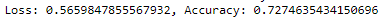
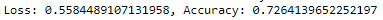
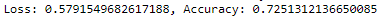
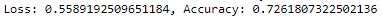
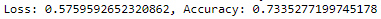

# Neural_Network_Charity_Analysis

## Analysis Overview
Alphabet Soup is a nonprofit philanthropic foundation dedicated to helping organizations that protect the environment, improve peoples well being, and unify the world. Alaphabet Soup has raised and donated over 10 billion dollars in the past 20 years. 

Our job is to analyze the impact of each donation and vet out potential recipients. This helps ensure that the foundations money is being used effectively. We are tasked with designing and training a deep learning neural network that will predict which organizations are worth donating to and which are hight risk. This model will evaluate all types of input data and produce a clear decision making result. 

We will be designing and training our model using the Python TensorFlow library and a CSV containing more than 34,000 organizations that have received funding from Alphabet Soup over the years. Within this dataset are a number of columns that capture metadata about each organization.

## Analysis Results
- Data Preprocessing 
	- The binary 'IS_SUCCESSFUL' variable is our target variable and let's us know if the money was used effectively. 
	- The rest of our beneficial variables make up our model features.  
		- 'APPLICATION_TYPE': Alphabet Soup application type
		- 'AFFILIATION': Affiliated sector of industry
		- 'CLASSIFICATION': Government organization classification
		- 'USE_CASE': Use case for funding
		- 'ORGANIZATION': Organization type
		- 'STATUS': Active status
		- 'INCOME_AMT': Income classification
		- 'SPECIAL_CONSIDERATIONS': Special consideration for application
		- 'ASK_AMT': Funding amount requested
	- We drop 'EIN' and 'NAME' because they are non-beneficial unique identifier variables and provide no predictive value to our model.
- Compiling, Training, and Evaluating our Models (5 different models are included in this repository) 
	- Number of neurons, layers, and activation functions. 
		- AlphabetSoupCharity model
			- 110 neurons
			- 2 hidden layers
			- Relu for our two hidden layers and sigmoid for our output layer. 
			- Unable to achive desired model performance of 75%   
		- AlphabetSoupCharity_Optimzation
			- 150 neurons in our hidden layers.
			- 4 hidden layers.
			- Relu, tanh, sigmoid, relu, and sigmoid for our first, second, third, fourth and output layers respectively. 
			- Unable to achive desired model performance of 75%   
		- AlphabetSoupCharity_Optimzation_2
			- 80 neurons in our hidden layers. 
			- 2 hidden layers.
			- Relu for our two hidden layers and tanh for our output layer. 
			- Unable to achive desired model performance of 75%   
		- AlphabetSoupCharity_Optimzation_3
			- 155 neurons in our hidden layers.
			- 5 hidden layers.
			- Relu, tanh, sigmoid, relu, relu, and sigmoid for our first, second, third, fourth, fifth, and output layers respectively. 
			- Unable to achive desired model performance of 75%   
		- AlphabetSoupCharity_Optimzation_4
			- 74 neurons in our hidden layers.
			- 4 hidden layers.
			- Sigmoid for all activation functions. 
			- Unable to achive desired model performance of 75%   
- Steps taken to try and increase model performance. 
	- Remove noisy variables from features. 
	- Add neurons to hidden layers.
	- Add hidden layers.
	- Changed the activation function of hidden layers and output layers.
	- Changed the number of epochs. 
	- Created a Keras hyperband tuner to search for the best parameters (this one worked the best)

## Analysis Summary
We were unable to meet our 75% accuracy goal with any of our models. With 73.35% accuracy our Keras hyperband tuner helped produce our top performing model. 

Given these results I would recommend the following. 
- Further analysis needed. 
- Find additional variables that can be used as predictive features for our model. 
- Try a random forest model as it is a widely used often effictive classification model that operates by constructing a multitude of decision trees.
